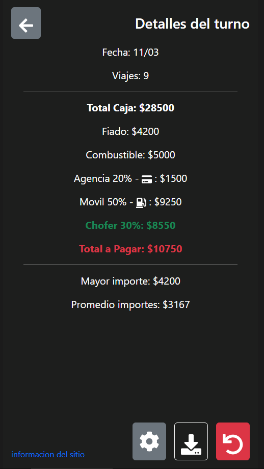

# 📝 Anotador de Viajes para Choferes

Aplicación diseñada para que los choferes puedan registrar fácilmente los viajes realizados desde su celular. Permite calcular los gastos y la ganancia de forma intuitiva, ofreciendo una herramienta simple pero efectiva para el control diario de ingresos.

---

## 🌟 Características principales

- 🚖 **Registro de viajes**: Permite anotar cada viaje con el importe y forma de pago.
- 📊 **Cálculo automático**: Muestra el total de ingresos y gastos del día (combustible y viajes fiados).
- 📱 **Diseño optimizado para móviles**: Interfaz diseñada exclusivamente para usar como app en celulares..
- 🔄 **Edición y eliminación rápida**: Permite modificar o borrar registros con facilidad.
- 📅 **Exportar y compartir detalle del turno**: Permite exportar el detalle del turno en pdf para compartir o almacenar.

     

---

## 🛠️ Tecnologías utilizadas

- **React**.
- **Bootstrap**

---

