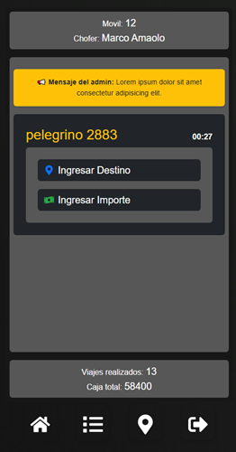
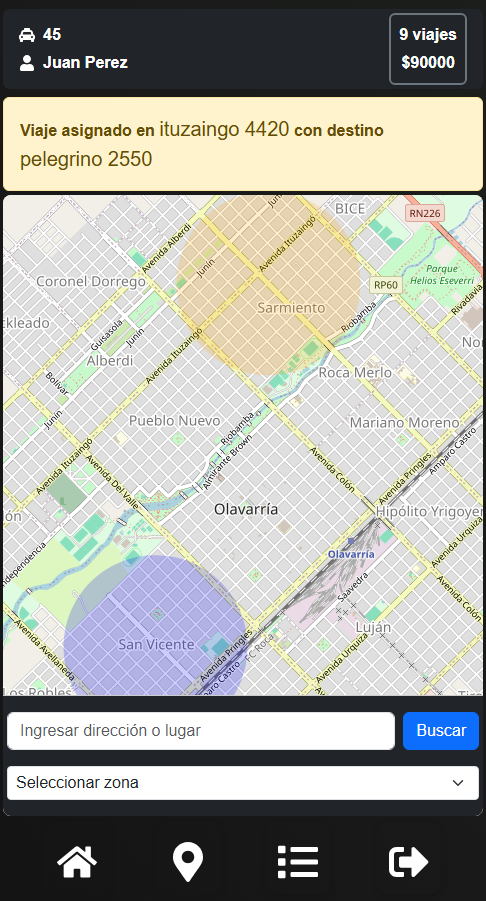
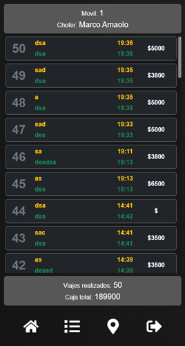

# 🚖 Aplicación para Choferes

Esta aplicación permite a los choferes recibir viajes asignados en tiempo real, actualizar su ubicación y registrar los detalles de cada viaje. Además, pueden enviar el destino e importe del viaje, así como llevar un control de la caja recaudada.

---

## 🌟 Características principales  
- 📲 **Recepción de viajes**: Los choferes reciben viajes asignados directamente en la aplicación.  
- 🚩 **Actualización de ubicación**: El chofer puede actualizar su ubicación para que los administradores sepan en que zona espera recibir viajes.  
- 💲 **Registro de importes**: Permite ingresar el destino y el importe del viaje.  
- 📊 **Historial de viajes**: Registro de viajes completados y caja recaudada.  
- 🔄 **Sincronización en tiempo real**: Todos los cambios se reflejan instantáneamente en el sistema de administración.  

     

## 🛠️ Tecnologías utilizadas

- **React**
- **Bootstrap** 
- **Node.js**
- **Express.js** 
- **JSON Web Tokens**  
- **Socket.io**
- **MySQL** 

---

Esta aplicación es un prototipo funcional desarrollado en React. En futuras versiones, se planea migrar a React Native para ofrecer una experiencia más fluida y optimizada en dispositivos móviles. 📱✨ 
