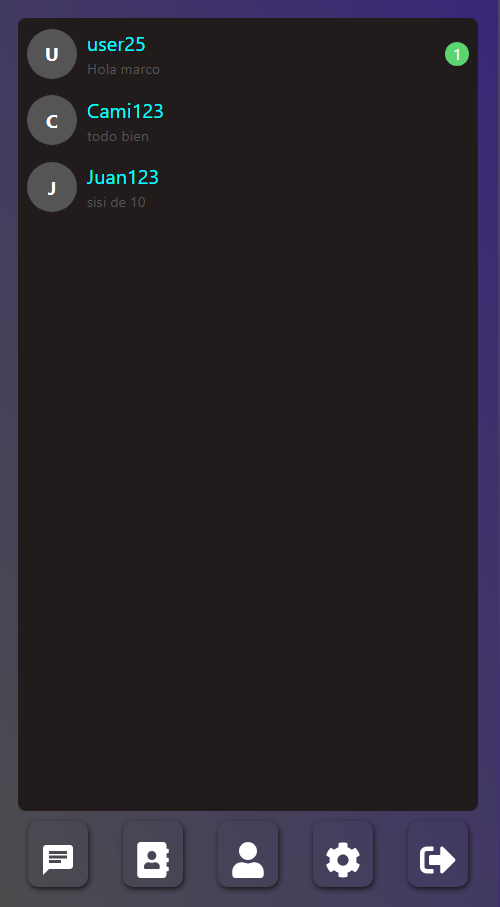
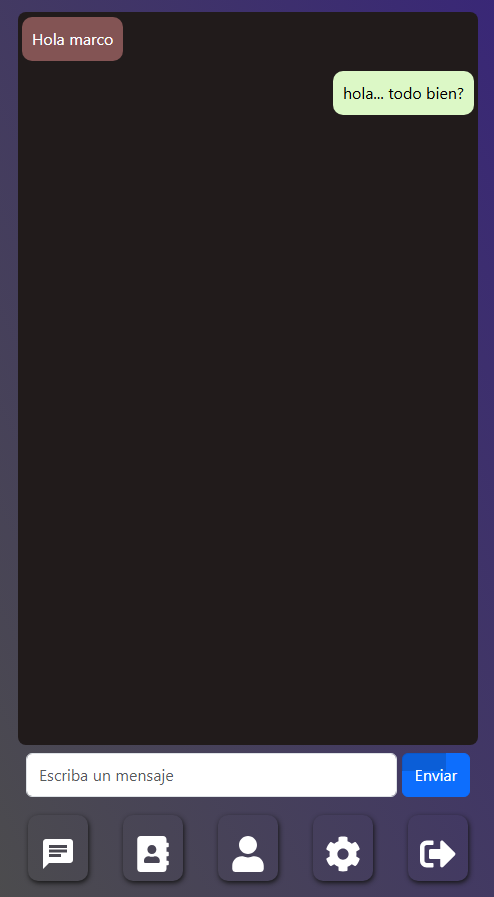

# 💬 Chat en Tiempo Real  

Aplicación web diseñada para ser utilizada en dispositivos móviles como una plataforma de mensajería simple y efectiva. Permite a los usuarios registrarse, iniciar sesión y mantener conversaciones privadas en tiempo real con otros usuarios registrados.  

🔹 **Backend disponible en dos versiones:**  
- **🔵 Versión MySQL**: Utiliza una base de datos relacional para gestionar usuarios y configuraciones.  
- **🟢 Versión MongoDB**: Implementación basada en NoSQL para un rendimiento optimizado en el almacenamiento de mensajes en tiempo real.  

📌 **Repositorios:**  
🔗 [Versión MySQL](https://github.com/MarcoA36/chat_mySql_back) | 🔗 [Versión MongoDB](https://github.com/MarcoA36/chat_socket_back)  

---

## 🌟 Características principales  

- 🔐 **Registro e inicio de sesión**: Creación de cuenta y acceso con credenciales seguras.  
- 💬 **Mensajería en tiempo real**: Comunicación fluida sin necesidad de recargar la página.  
- 👥 **Conversaciones privadas**: Solo los usuarios registrados pueden enviarse mensajes entre sí.  
- 📱 **Optimizado para móviles**: Interfaz diseñada para su uso en celulares como una PWA.  
- 📜 **Historial de conversaciones**: Almacenamiento del historial de chats para su consulta posterior.  

   

---

## 🛠️ Tecnologías utilizadas  

- **React**: Desarrollo del frontend interactivo.  
- **Node.js**: Servidor backend para manejar autenticación y mensajes.  
- **Bootstrap**: Diseño adaptable y optimizado para dispositivos móviles.  
- **MySQL**: Base de datos relacional utilizada en la versión SQL.  
- **MongoDB**: Base de datos NoSQL utilizada en la versión alternativa para almacenamiento de mensajes en tiempo real.  

