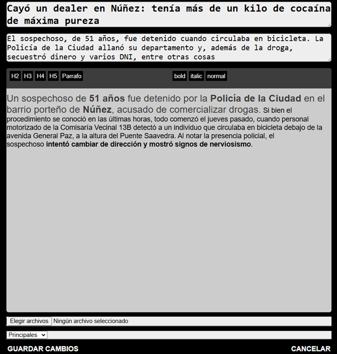
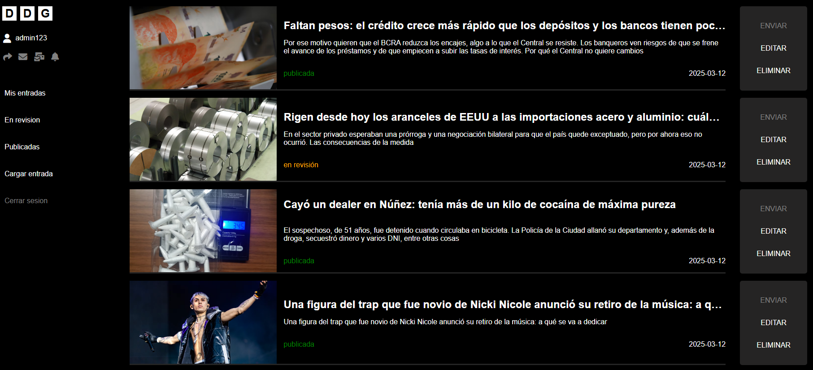
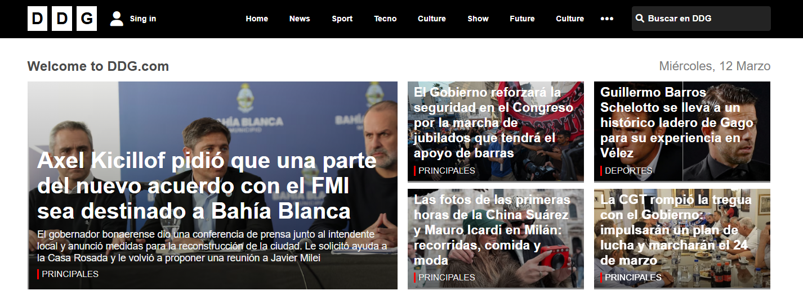

# 📰 Diario Digital con Panel de Administración

Sistema completo para gestionar un diario en línea. Permite la creación, edición, revisión y publicación de noticias desde un **panel de administración**, hasta su visualización en la página principal.  

## 🖥️ Panel de Administración  

El panel de administración permite gestionar todas las publicaciones del diario digital. Desde aquí, los redactores pueden cargar y enviar noticias para su revisión, mientras que los administradores tienen control total sobre su publicación.

### 🌟 Características principales  

- ✍️ **Editor de texto** integrado para la redacción de noticias.  
- 👥 **Dos niveles de usuarios**:  
  - **Redactor**: Solo puede crear noticias y enviarlas para revisión.  
  - **Administrador general**: Puede **aprobar, editar y publicar** noticias en la página principal.  
- 💬 **Sistema de mensajería interna** entre redactores y administradores.  
- 📰 **Control de publicación**: El administrador decide la ubicación de la noticia en la página principal (noticia destacada, secundaria o en una categoría específica).  

  
  

## 🏠 Página Principal  

La página principal muestra las noticias **publicadas desde el panel de administración** y las organiza según su categoría.

Cuenta con dos versiones:  
- **🟢 Diario Digital JS**: Usa módulos (`import/export`) para estructurar el código en componentes reutilizables.  
- **🔵 Diario Digital PHP**: Implementa una estructura modular con `include` y `require` para facilitar el mantenimiento.  

### 🌟 Características principales  

- 📡 **Consumo de noticias** cargadas desde el panel de administración.  
- 🔍 **Buscador** para encontrar noticias por palabra clave.  
- 📰 **Secciones organizadas** según la categoría de cada noticia.  
- 🎨 **Clonación del diseño de [BBC News](https://www.bbc.com/)**(2022).  

  

  

### 🛠️ Tecnologías  

- **HTML5**
- **CSS**
- **JavaScript**
- **PHP**
- **MySQL**
- **Sin dependencias externas**: Este sistema está desarrollado únicamente con **JavaScript, PHP y CSS Vanilla**, sin frameworks ni librerías adicionales, excepto **Font Awesome** para los iconos.  
---
