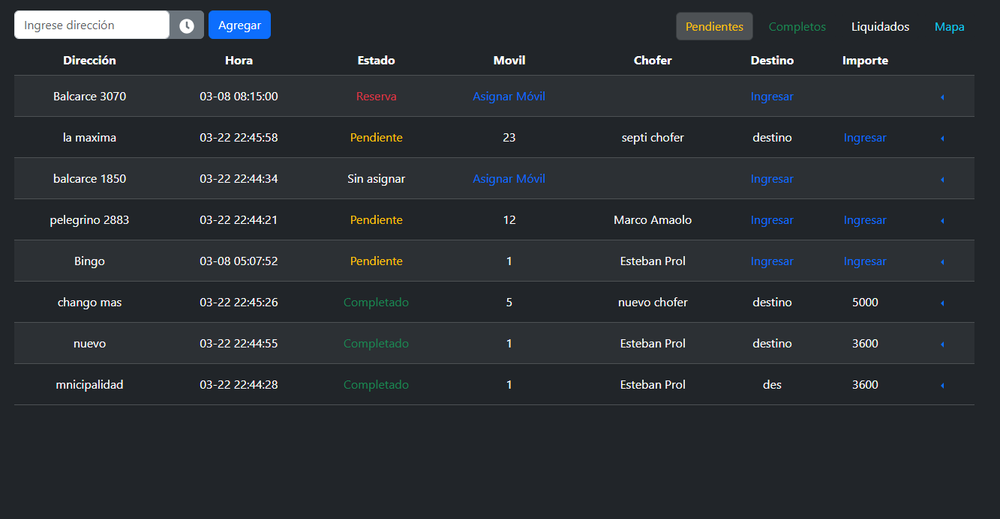
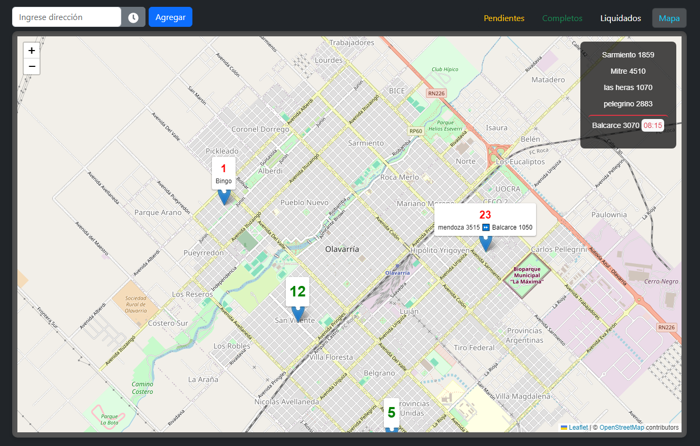
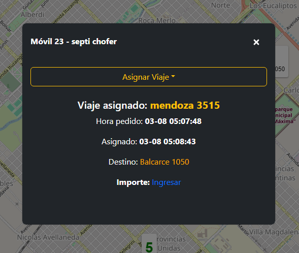
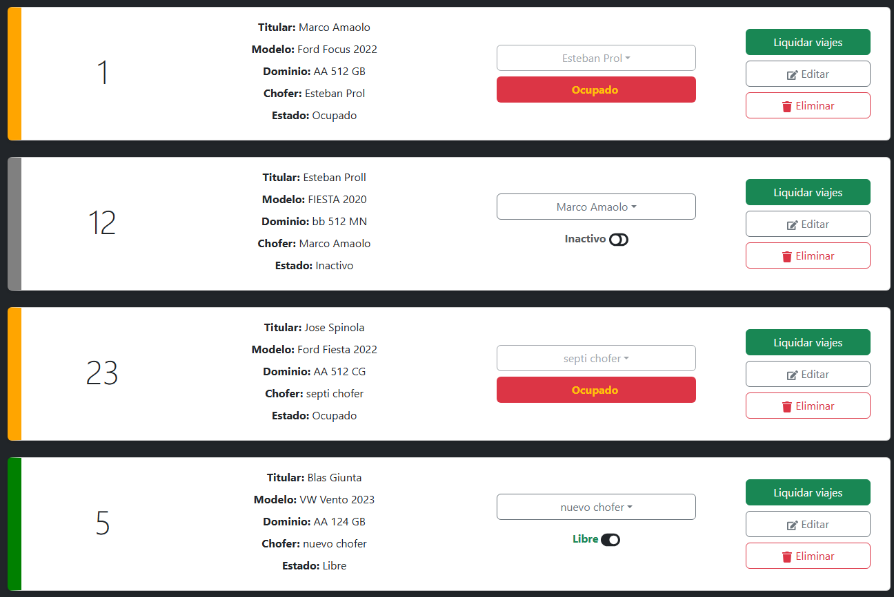

# 🚖 Sistema de Gestión para Empresa de Taxis

Este sistema está diseñado para permitir a una empresa de taxis gestionar de manera eficiente las operaciones diarias, incluyendo la asignación de viajes a los conductores, el seguimiento de las rutas y la comunicación en tiempo real entre los administradores y los choferes. Los administradores pueden supervisar el estado de los viajes, asignar viajes a choferes y obtener estadísticas en tiempo real. Los choferes cuentan con una aplicación para recibir viajes y comunicarse directamente con la administración, pasando destinos de viaje, importes y ubicación actual.

---

## 🌟 Características principales

- 🧑‍💼 **Panel de administración**: Los administradores pueden asignar viajes, ver el estado de los choferes y gestionar los viajes en curso.
- 🔄 **Comunicación en tiempo real**: Usando **Socket.io**, la comunicación entre los administradores y choferes se realiza en tiempo real.
- 📊 **Gestión de viajes**: Registro de todos los viajes realizados, con detalles sobre los choferes, pasajeros y el estado del viaje.
- ⏱️ **Actualización en tiempo real**: Los administradores pueden ver el estado en tiempo real de cada viaje y el progreso de los choferes.  
  Cada modificación realizada por un administrador se refleja automáticamente en el resto de los administradores y en el chofer correspondiente.
- 📲 **Aplicación para choferes**: Los choferes reciben viajes directamente desde su [página personal](http://localhost:5173/proyectos/app_chofer)

---

### 📌 **Registro de viajes pendientes**
En esta sección, los administradores pueden gestionar los viajes en espera. La tabla es dinámica y permite ingresar el importe del viaje, asignar un destino y seleccionar el móvil que realizará el servicio. Cada cambio realizado se actualiza automáticamente en el sistema para todos los administradores y para el chofer que corresponda.  
  

---

### 🚩 **Mapa con la ubicación de los choferes**
Los administradores pueden modificar la ubicación de los móviles activos simplemente arrastrando el marcador en el mapa con el mouse.  
En el caso de la aplicación del chofer, el marcador se puede mover arrastrándolo con el dedo.  
Cualquier modificación se refleja en tiempo real tanto en la página de administración como en la aplicación del chofer correspondiente.  
  

---

### 🚗 **Estado del móvil activo**
Se puede seleccionar un móvil en particular y asignarle un viaje o completar información, de la misma forma que en la tabla de viajes pendientes.  
  

---

### 🚘 **Sección móviles**
En esta sección, los administradores pueden activar o desactivar un móvil según su disponibilidad.  
También pueden liquidar los viajes realizados y descargar un resumen en PDF para compartirlo o almacenarlo.  
  

### 🔹 **Otras secciones**  
Además, el sistema incluye todas las herramientas necesarias para una gestión completa, tales como:  

- **Liquidación de viajes**: Permite calcular y registrar los pagos correspondientes a cada chofer.  
- **Historial de liquidaciones**: Acceso a un registro detallado de todas las liquidaciones realizadas.  
- **Reservas semanales**: Registro de reservas anticipadas. 
- **Gestión de clientes**
- **Gestión de choferes**

## 🛠️ **Tecnologías utilizadas**
- **React**: Frontend para la interfaz web del administrador.
- **Bootstrap**: Diseño optimizado para pc y tablet.
- **Redux Toolkit**: Gestión del estado de viajes, choferes y móviles.
- **Node.js**: Backend para la API y lógica de negocio.
- **Express.js**: Framework para la creación de la API RESTful.
- **JWT**: Autenticación segura para el acceso de usuarios.
- **Socket.io**: Comunicación en tiempo real entre administradores y choferes.
- **MySQL**: Base de datos relacional para almacenamiento de datos.
---

Si bien el sistema aún requiere optimizaciones y mejoras, me he preocupado por aplicar las mejores prácticas en su desarrollo, asegurando una estructura consistente y escalable que facilite futuras actualizaciones.  
